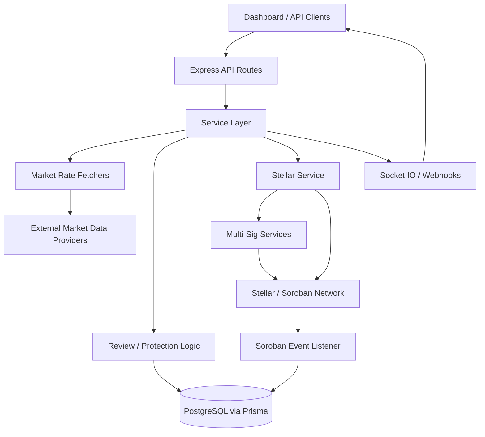

# StellarFlow Backend

TypeScript/Node.js backend for the StellarFlow oracle network. This service fetches localized market data, reviews and stores it, exposes API endpoints for consumers, and submits approved updates to Stellar.

## Features

- Express API with market-rate, history, stats, intelligence, asset, price update, and status routes
- Market data fetchers for NGN, KES, GHS, and shared provider integrations
- Prisma/PostgreSQL persistence for price history, on-chain confirmations, provider reputation, and multi-signature workflows
- Stellar submission flow with optional multi-signature approval
- Socket.IO broadcasting for live dashboard updates
- Swagger docs at `/api/docs`

## Tech Stack

- Node.js + TypeScript
- Express
- Prisma + PostgreSQL
- Socket.IO
- Stellar SDK / Soroban integrations

## Quick Start

### Prerequisites

- Node.js 18+
- PostgreSQL
- A configured `.env` file with the required Stellar and database secrets

### Installation

```bash
git clone https://github.com/StellarFlow-Network/stellarflow-backend.git
cd stellarflow-backend
npm install
cp .env.example .env
```

### Run the Server

```bash
npm run dev
```

### Build and Start

```bash
npm run build
npm start
```

## System Flow



### Flow Summary

1. Clients call the backend through the Express API.
2. The service layer fetches rates from market-data providers and normalizes them.
3. Review and protection logic decides whether the rate can proceed automatically or needs additional handling.
4. Approved updates are stored in PostgreSQL and submitted to Stellar directly or through the multi-signature workflow.
5. On-chain events are observed and written back into backend storage.
6. Live updates are pushed back to connected clients through Socket.IO and webhook-style notifications.

## Project Structure

```text
src/
├── controllers/   # Request handlers
├── lib/           # Prisma, Swagger, Socket.IO setup
├── logic/         # Shared domain logic such as filtering
├── middleware/    # API middleware
├── routes/        # Express route modules
├── services/      # Market rate, Stellar, intelligence, review, and multi-sig services
└── utils/         # Environment, retry, time, and conversion helpers

prisma/
├── schema.prisma  # Database schema
└── seed.ts        # Seed script
```

## Useful Scripts

```bash
npm run dev
npm run build
npm run lint
npm run format:check
npm run test
npm run db:generate
npm run db:push
```

## API Docs

After the server starts, open:

```text
http://localhost:3000/api/docs
```
